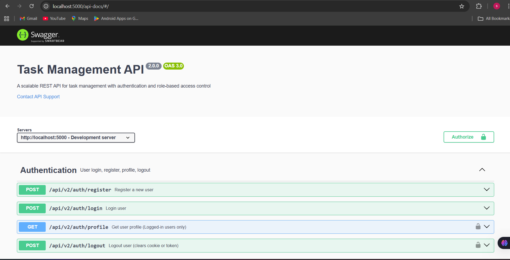
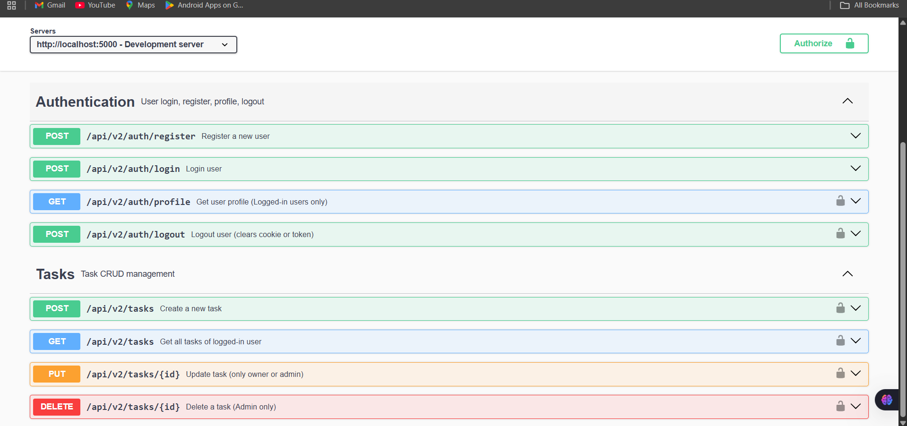
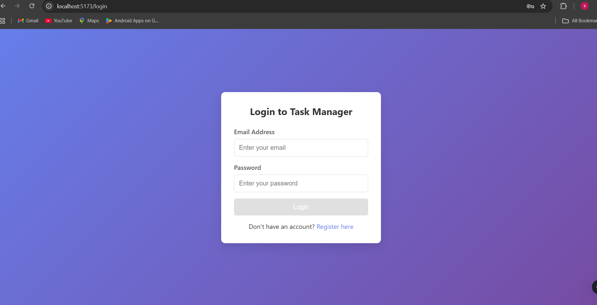
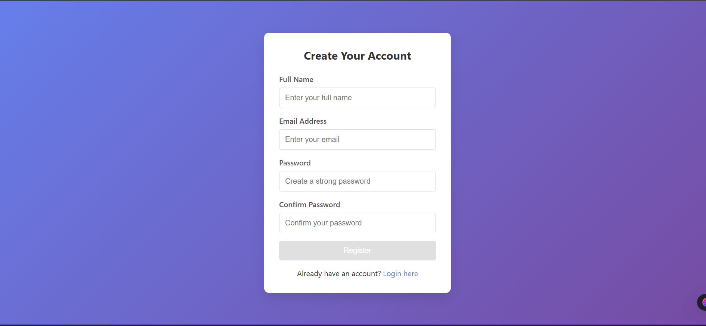
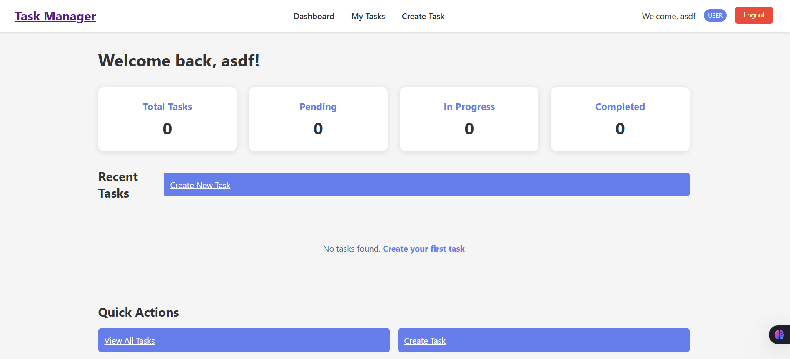
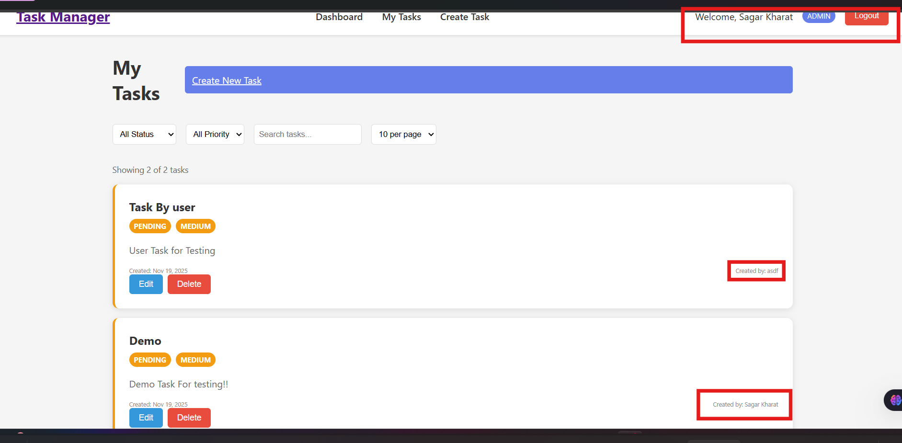

# 🚀 Task Management API (v2.0)

A production-ready Task Management API built with **Node.js, Express, MongoDB, JWT Authentication, and Role-Based Access Control (RBAC)**.  
Includes a **React frontend**, **Swagger documentation**, and **secure backend architecture**.

---

## ✨ Features

### 🔐 Authentication & Security
- JWT-based authentication (Bearer Token & HttpOnly Cookie)
- Role-Based Access Control (`user`, `admin`)
- Password hashing with bcrypt
- Input validation using validator.js
- Helmet, rate limiting, and CORS protection

### 📝 Task Management (CRUD)
| Role  | Permissions                      |
|-------|----------------------------------|
| User  | Create, Read, Update **own tasks** |
| Admin | Full CRUD on **all tasks**         |

### 🧑‍💼 Demo Admin Credentials

| Email                  | Password   |
|------------------------|------------|
| sagarkharat23@gmail.com| 123456Aa   |


### 📖 API Documentation
| Tool             | Location                           |
|------------------|------------------------------------|
| Swagger UI       | `http://localhost:5000/api-docs`   |
| Postman Collection | `Simple_API_Collection.postman_collection.json` |

---

## 🗂️ Tech Stack

| Component | Technology         |
|-----------|-------------------|
| Backend   | Node.js, Express  |
| Frontend  | React (Vite)      |
| Database  | MongoDB + Mongoose|
| Auth      | JWT, bcrypt       |
| Security  | Helmet, CORS, Rate Limiting |
| Docs      | Swagger & Postman |

---

## 📁 Folder Structure

```
project/
│── backend/
│   ├── controller/
│   ├── middleware/
│   ├── model/
│   ├── routes/
│   ├── .env
│   ├── index.js
│   └── API_DOCS.md
│
│── frontend/
│   ├── public/
│   └── src/
│
│── Simple_API_Collection.postman_collection.json
│── README.md
```

---

## ⚙️ Installation & Setup

### 1️⃣ Backend Setup
```bash
cd backend
npm install
npm start
```

### 2️⃣ Frontend Setup
```bash
cd frontend
npm install
npm run dev
```

### 🔐 Environment Variables (.env)
```ini
PORT=5000
MONGO_URL=YOUR_MONGODB_URI
JWT_KEY=YOUR_SECRET_KEY
NODE_ENV=development
```

---

## 🚀 API Endpoints Overview

### 🔑 Authentication
| Method | Endpoint                | Description           |
|--------|------------------------|-----------------------|
| POST   | /api/v2/auth/register  | Register new user     |
| POST   | /api/v2/auth/login     | Login & get JWT       |
| GET    | /api/v2/auth/profile   | Get user profile      |
| POST   | /api/v2/auth/logout    | Logout user (protected)|

### 📝 Tasks
| Method | Endpoint              | Access        |
|--------|----------------------|--------------|
| POST   | /api/v2/tasks        | User/Admin   |
| GET    | /api/v2/tasks        | User/Admin   |
| PUT    | /api/v2/tasks/:id    | Owner/Admin  |
| DELETE | /api/v2/tasks/:id    | Admin Only   |

---

## 🛡️ Security Highlights
| Feature                | Status |
|------------------------|--------|
| HttpOnly Cookie        | ✔      |
| JWT-based Authorization| ✔      |
| bcrypt Password Hashing| ✔      |
| Role-Based Access Control| ✔    |
| API Rate Limiting      | ✔      |
| Input Validation       | ✔      |

---

## 📚 API Documentation Preview
- ✔ Live Swagger URL: http://localhost:5000/api-docs
- 🟣 JWT Authorization enabled
- 🟢 Try-It-Out supported

---

## 🚀 Scalability & Deployment Readiness
| Feature                        | Status |
|--------------------------------|--------|
| Modular folder structure       | ✔      |
| MongoDB Atlas ready            | ✔      |
| Docker deployable              | 🔜 Optional |
| Microservice-friendly architecture | ✔   |
| Redis caching support (optional) | 🔜   |

---

## 📸 Screenshots (Swagger & UI)
- Swagger API



- Task UI


#user



#Admin

---
